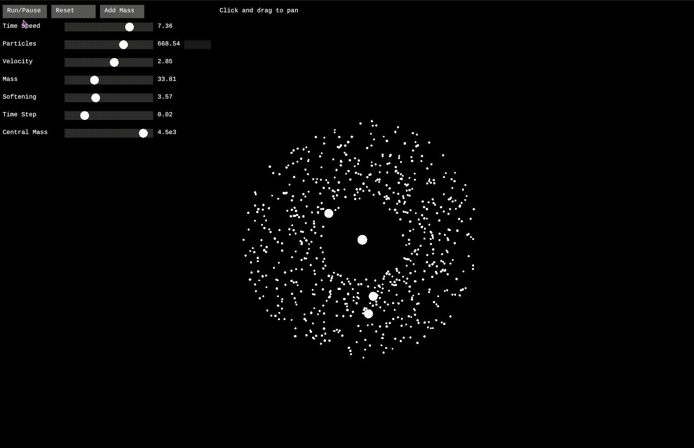

# Solar Sim
A gravitational N-body simulation with interactive parameters.  
`Can you balance the system?`

## Controls and Interactions

| Control | Action | Effect in Simulation |
|---------|---------|-------------------|
| Left Click + Drag | Pan view | Moves viewport without affecting simulation |
| Mouse Wheel | Zoom in/out | Adjusts view scale for observing different scales of interaction |
| WASD Keys | Camera movement | Alternative pan controls for precise viewport adjustment |
| Space | Pause/Resume | Freezes/unfreezes particle motion while maintaining system state |
| R | Reset simulation | Returns to initial conditions with current parameter values |
| Add Mass Button | Enter mass placement mode | Allows adding new gravitational bodies |

## Parameters and Their Effects

| Parameter | Range | Definition | Simulation Effect |
|-----------|-------|------------|------------------|
| Time Speed | 0.1 - 10.0 | Simulation speed multiplier | Higher values accelerate simulation but may reduce accuracy |
| Particles | 10 - 1000 | Number of orbiting bodies | Affects computational load (O(n²)) and system complexity |
| Velocity | 0.1 - 5.0 | Initial orbital velocity multiplier | Controls escape velocity ratio; affects orbit stability |
| Mass | 0.1 - 100.0 | Base mass for orbiting particles | Influences gravitational interactions and visual size |
| Softening | 0.1 - 10.0 | Close encounter stability factor | Prevents numerical instabilities at cost of accuracy |
| Time Step | 0.001 - 0.1 | Integration time interval | Smaller values increase accuracy but slow simulation |
| Central Mass | 100 - 5000 | Primary body mass | Determines system's gravitational center strength |

## Large-Scale Considerations

The following parameters become significant in larger astronomical simulations but are simplified or omitted in this demonstration:

1. Relativistic Effects
   - Light speed limitations
   - Gravitational time dilation
   - Space-time curvature

2. Physical Properties
   - Angular momentum
   - Tidal forces
   - Radiation pressure
   - Gas/dust dynamics

3. Computational Optimizations
   - Barnes-Hut tree algorithm
   - Fast Multipole Method
   - Parallel computation
   - Adaptive time stepping

4. Environmental Factors
   - Dark matter effects 
   - Galactic tidal forces
   - Interstellar medium interactions